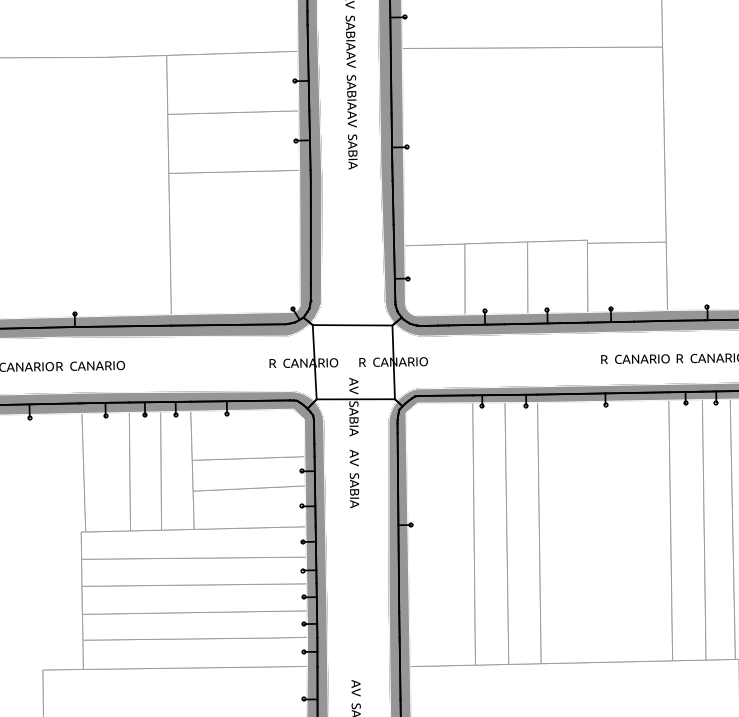

# Segmentos de Rotas nas calçadas

Repositório destinado a métodos e resultados dos segmentos das redes de rotas nas calçadas da cidade de São Paulo à partir de dados abertos, cadastrais e restituidos disponívels no site do GeoSampa

## Motivação

Esses métodos e resultados publicados aqui fazem parte da pesquisa AndaSampa: A rede de rotas caminháveis (e cadeiráveis) na cidade de São Paulo, que tem como objetivo estudar a cidade à partir da perspectiva da pedestre e para isso acredita que uma Rede de Rotas caminháveis e cadeiráreis seja impressindível para tanto.

## Objetivo

O objetivo deste repositório portanto é desenvolver um método para extrair a representação dos segmentos de rota nas calçadas da cidade de São Paulo, assim como a publicação desses resultados.

## Metodologia

A partir do geoprocessamento de alguns dados cartográficos disponíveis, como quadras prediais, quadras viárias, lotes e polígonos de vias, propõe-se a extração das geometrias das calçadas e a partir desse poígonos traçar o eixo medial aproximado que deve servir como abstração de cada segmento caminhável de calçada.
Inicialmente é realizado a operação boolena de subtração da quadra predial em relação à quadra viária de uma região previamente estabelecida.
Com geometria resultante então é possível processar um eixo medial com PostGis e então conectar lotes utilizando Python, GeoPandas e Shapely em Notebooks passo-a-passo.

## Resultados 

Os resultados preliminares estão disponibilizados na pasta `resultados` e o método descrito em Jupyter Notebooks, aplicados para uma região do distrito de Moema.

## Próximos passos

A intenção é aumentar a àrea de processamento para um distrito inteiro e a cidade inteira. Paralelamente a isso ainda se faz necessário a identificação das faixas de pedestre e elementos físicos de travessia como passarelas, passagens subterrÂneas e viadutos em outros repositórios aqui da pesquisa.

